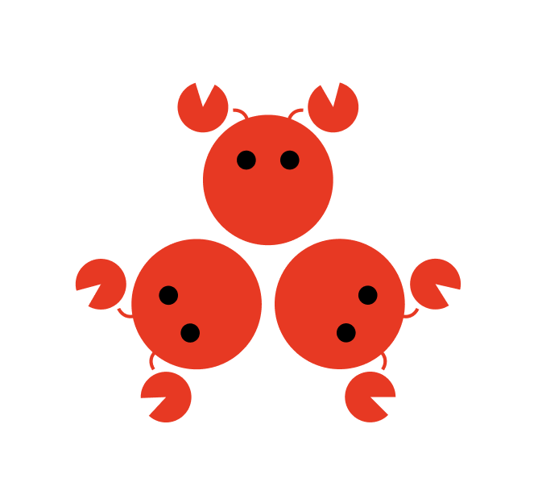

<p align="center">
  
</p>

<h1 align="center">Multi-Agent OpenClaw</h1>

<p align="center">
  <strong>Design, refine, and execute multi-agent workflows through a conversational UI.</strong>
</p>

<p align="center">
  Built on <a href="https://github.com/nicepkg/openclaw">OpenClaw</a> · MIT License
</p>

## What it does

You describe a multi-agent scenario in natural language. The system creates a team of AI agents — each with a goal, not a script — and runs them through rounds of interaction. Agents react dynamically to what others have said, so the output emerges organically rather than following rigid instructions.

### Examples

**VC shark tank** *(5 rounds)*
> "A founder pitches their AI startup to 3 rival VCs. One is a true believer who wants to lead the round, one is a ruthless skeptic trying to kill the deal so nobody invests, and one is a cutthroat who wants to steal the deal at a lower valuation. The VCs trash-talk each other's investment theses while fighting over (or against) the founder. Everthing stops after 5 rounds."


**Structured debate with secret intel**
> "Mars colony discovers an underground water reservoir. Team Science wants to study it for 2 years. Team Colony wants to tap it immediately for survival. Each team has secret information the other doesn't know. A Moderator runs the debate and decides."
>
> 5 agents — 2 per team + moderator. Teams present opening arguments with hidden knowledge, then cross-examine, then the moderator delivers a ruling.

**Hostile Twitter drama**
> "Three Twitter accounts: Alice, Bob, and Charlie. Alice and Bob are best friends — they like and hype each other's posts. Charlie hates them both and trolls every thread. They argue publicly across each other's feeds."
>
> 3 agents, 3 rounds — each round escalates. Alice and Bob coordinate support while Charlie attacks. Agents remember prior rounds, so the beef gets personal.


## Quick start

### 1. Install

```bash
git clone <repo-url> && cd claw-conductor
npm install
cd ui && npm install && cd ..
```

### 2. Configure

```bash
cp .env.example .env
```

Edit `.env` with your preferred LLM provider:

```bash
# Anthropic (default)
ANTHROPIC_API_KEY=sk-ant-api03-your-key-here

# — or OpenAI —
OPENAI_API_KEY=sk-your-key-here

# — or Google Gemini —
GEMINI_API_KEY=your-key-here

# — or any OpenAI-compatible provider (Groq, OpenRouter, Together, Ollama, vLLM, xAI, Mistral, …) —
LLM_PROVIDER=groq
LLM_API_KEY=your-key-here
LLM_BASE_URL=https://api.groq.com/openai/v1
```

### 3. Run

```bash
# Terminal 1: Backend
npm run server

# Terminal 2: UI dev server
npm run ui:dev
```

Open [http://localhost:5174](http://localhost:5174) in your browser.

## How it works

```
┌─────────────────────────────────────────────────────────────────┐
│  1. PLANNING  (any LLM provider, multi-turn chat)               │
│                                                                 │
│  User describes scenario  ──►  LLM extracts agents + rounds    │
│                                                                 │
│  ┌───────────┐ ┌───────────┐ ┌───────────┐                     │
│  │  Agent 1  │ │  Agent 2  │ │  Agent N  │                     │
│  │  name     │ │  name     │ │  name     │  ...                │
│  │  role     │ │  role     │ │  role     │                     │
│  │  goal     │ │  goal     │ │  goal     │                     │
│  └───────────┘ └───────────┘ └───────────┘                     │
│                                                                 │
│  Rounds: N    (no scripts — just goals)                         │
└────────────────────────┬────────────────────────────────────────┘
                         │
                         ▼
┌─────────────────────────────────────────────────────────────────┐
│  2. EXECUTION  (any LLM provider, per-agent sessions)           │
│                                                                 │
│  Round 1: each agent gets  goal + "this is round 1"            │
│           all agents run in parallel                            │
│                                                                 │
│     Agent 1 responds    Agent 2 responds    Agent N responds    │
│                                                                 │
│  Round 2: each agent gets  goal + FULL TRANSCRIPT of round 1   │
│           agents react to what others said                      │
│                                                                 │
│     Agent 1 sees what 2..N said → adapts                        │
│     Agent 2 sees what 1..N said → adapts                        │
│                                                                 │
│  ...                                                            │
│                                                                 │
│  Round N: goal + transcript of ALL prior rounds                 │
│           drama / analysis / debate culminates                  │
│                                                                 │
│  ⏹ Stop / ▶ Resume at any round boundary                       │
└────────────────────────┬────────────────────────────────────────┘
                         │
                         ▼
┌─────────────────────────────────────────────────────────────────┐
│  3. REAL-TIME UI  (WebSocket)                                   │
│                                                                 │
│  Live turn-by-turn updates as agents respond                    │
│  View by Agent  │  by Round  │  All Turns                       │
│  History persisted to disk                                      │
└─────────────────────────────────────────────────────────────────┘
```

## Built on OpenClaw

This project is part of the [OpenClaw](https://github.com/nicepkg/openclaw) ecosystem. OpenClaw provides the foundation for AI agent orchestration, including:

- Agent identity and session management
- Multi-channel communication (Discord, Telegram, Slack, CLI)
- Tool execution and browser automation
- Gateway-based agent routing

Multi-Agent OpenClaw extends OpenClaw's capabilities by adding a **multi-agent planning and coordination layer** with a visual UI for designing and monitoring complex agent scenarios.

## Supported LLM providers

| Provider | Config |
|---|---|
| **Anthropic** (default) | `ANTHROPIC_API_KEY` |
| **OpenAI** | `OPENAI_API_KEY` |
| **Google Gemini** | `GEMINI_API_KEY` |
| **Groq** | `LLM_PROVIDER=groq` + `LLM_API_KEY` + `LLM_BASE_URL=https://api.groq.com/openai/v1` |
| **OpenRouter** | `LLM_PROVIDER=openrouter` + `OPENROUTER_API_KEY` + `LLM_BASE_URL=https://openrouter.ai/api/v1` |
| **Together** | `LLM_PROVIDER=together` + `TOGETHER_API_KEY` + `LLM_BASE_URL=https://api.together.xyz/v1` |
| **xAI (Grok)** | `LLM_PROVIDER=xai` + `XAI_API_KEY` + `LLM_BASE_URL=https://api.x.ai/v1` |
| **Mistral** | `LLM_PROVIDER=mistral` + `MISTRAL_API_KEY` + `LLM_BASE_URL=https://api.mistral.ai/v1` |
| **Cerebras** | `LLM_PROVIDER=cerebras` + `LLM_API_KEY` + `LLM_BASE_URL=https://api.cerebras.ai/v1` |
| **Ollama** (local) | `LLM_PROVIDER=ollama` + `LLM_BASE_URL=http://localhost:11434/v1` + `LLM_MODEL=llama3` |
| **vLLM** (local) | `LLM_PROVIDER=vllm` + `LLM_BASE_URL=http://localhost:8000/v1` + `LLM_MODEL=your-model` |
| Any OpenAI-compatible | `LLM_PROVIDER=custom` + `LLM_API_KEY` + `LLM_BASE_URL` + `LLM_MODEL` |

## Environment variables

| Variable | Required | Description |
|---|---|---|
| `ANTHROPIC_API_KEY` | * | Anthropic API key (default provider) |
| `OPENAI_API_KEY` | * | OpenAI API key |
| `GEMINI_API_KEY` | * | Google Gemini API key |

\* At least one provider API key is required. See `.env.example` for all options.

## Architecture

```
src/
├── env.ts          — .env file loader
├── llm.ts          — Unified LLM provider abstraction (Anthropic, OpenAI, Google, OpenAI-compatible)
├── planner.ts      — Plan generation + execution engine
├── openclaw.ts     — Agent execution via LLM abstraction
├── server.ts       — HTTP/WebSocket server (REST API + real-time updates)
└── main.ts         — CLI entry point

ui/
├── index.html
├── vite.config.ts
└── src/
    ├── styles/     — CSS design tokens + layout + components
    └── ui/
        ├── app.ts  — Root Lit component with state management
        ├── api.ts  — REST + WebSocket client
        ├── icons.ts
        ├── types.ts
        └── views/  — Chat, Plan, Execution, History
```

## Production build

```bash
npm run ui:build
npm run server
# Serves built UI + API on http://localhost:3100
```

## License

MIT
